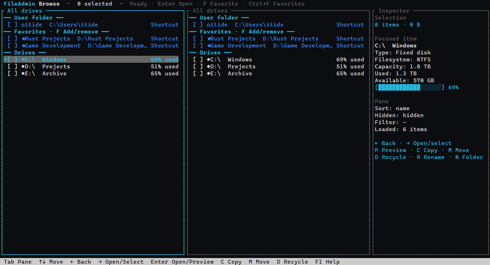
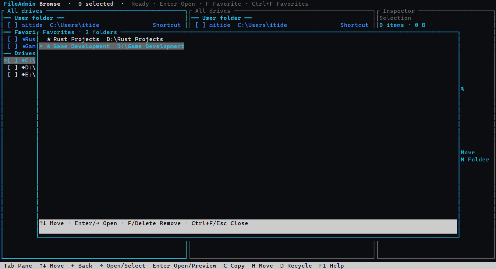
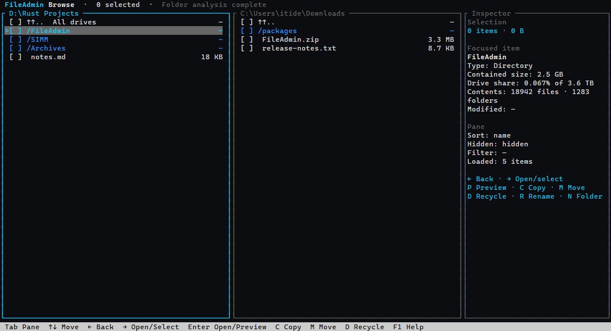
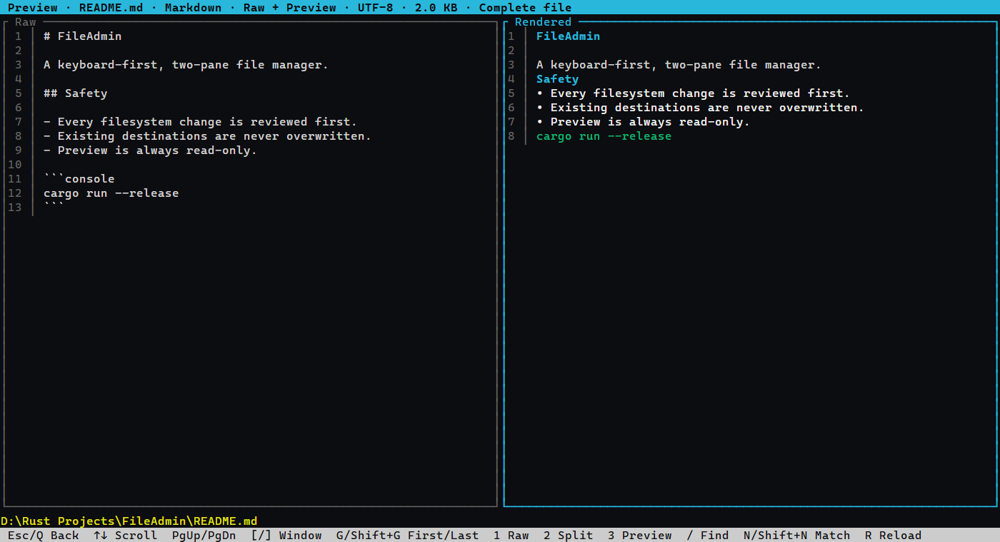
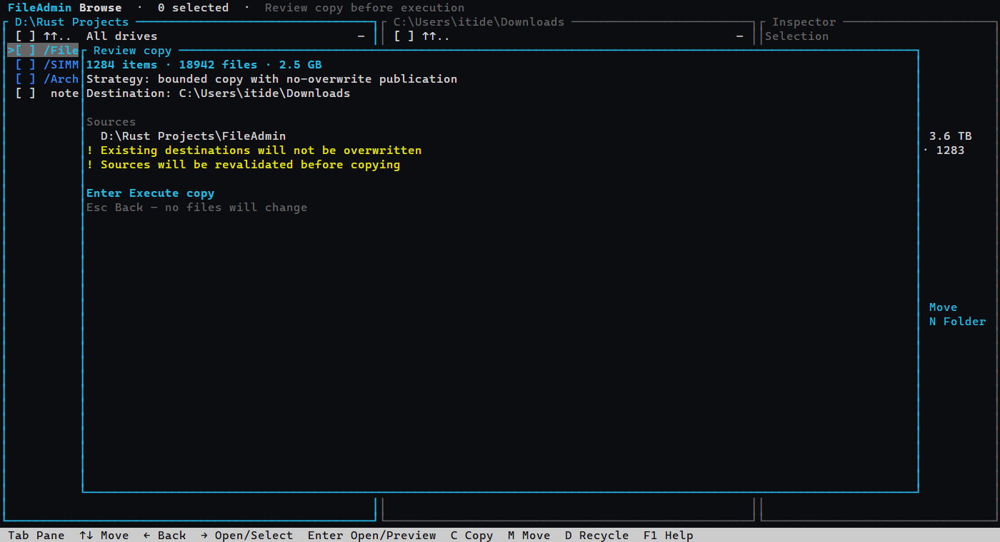

# FileAdmin

FileAdmin is a Rust terminal application for fast, understandable file
management. It combines a keyboard-first two-pane browser with an explicit
operation queue, device-aware transfer planning, and safety-focused previews.

The current milestone combines a functional two-pane browser with reviewed
filesystem operations. It can navigate and select in either pane, filter and
sort entries, toggle dotfiles, inspect metadata, preview human-readable files,
and plan copy, move, recycle, permanent-delete, rename, or folder-creation jobs
while directory work remains responsive. On Windows, the all-drives view reports
volume labels, types, filesystems, capacity, used space, and available space.

Focusing a directory starts a replaceable background traversal. The inspector
shows its total contained file size, file/folder counts, and that total as a
percentage of the containing drive's capacity. Moving focus cancels stale work;
links and inaccessible items are skipped and identified when the result is
partial. While traversal is running, live discovered bytes and file/folder
counts provide an indeterminate progress indicator. Recently completed results
are reused within the same pane generation when focus returns to a folder.

Modified times are displayed in the machine's local time as readable calendar
dates. UTC is labeled explicitly only if the operating system's local offset is
unavailable.

Text preview replaces the complete browser display until it is closed. It
supports line-numbered logs, configuration, plain text, and source files;
Markdown Raw, Split, and rendered modes; JSON Raw and Pretty modes; and bounded
literal or regular-expression Find. Large logs open at their tail, while other
large text files open at their head, with the loaded byte range labeled clearly.
Crossing an edge loads the adjacent window in the background without discarding
the visible window first. Preview also detects source size or modified-time
changes and offers an explicit reload instead of silently replacing the view.

Every change is planned first and shown in a confirmation dialog. Copy and move
first perform a metadata-only count of files, folders, and logical bytes without
retaining a file manifest or imposing the permanent-delete manifest limit. The
review therefore shows exact transfer scope, and execution starts with a real
progress-bar denominator. Execution traverses the tree again and feeds a bounded
work queue. Cross-volume transfers can copy up to two independent files at once;
same-volume transfers use one file worker to avoid competing seeks. Existing
folders merge; colliding files pause discovery for a six-choice conflict decision
while already queued work continues. File conflicts and file/folder type
conflicts have separate per-job Apply-to-all policies. Recycle
uses the operating-system Recycle Bin or Trash and never falls back to permanent
deletion. Permanent deletion is a separate mode with an additional typed
confirmation. Its planning screen scans the full tree without changing it, and
its review and progress screens report files, folders, and logical bytes instead
of treating a large directory as one item.

## User guide

### Running FileAdmin

Normal use starts with the packaged `fileadmin.exe`; Rust and Cargo are not
required. Open the executable directly or run it from a terminal:

```console
.\fileadmin.exe
```

Use a terminal at least 80×24 characters. Both browser panes initially show All
drives, so behavior does not depend on the folder from which the executable was
started.

### Interface tour

These captures are rendered from FileAdmin's actual Ratatui interface at
140×38 terminal cells.

#### Drive-first browsing

The User folder and Favorites are kept separate from physical volumes. Focusing
a drive exposes its type, filesystem, capacity, usage, available space, and a
graphical usage bar.



#### Favorites

`Ctrl+F` opens the dedicated Favorites panel over the current browser state.
Saved folders can be opened in the active pane or removed directly from this
panel.



#### Folder inspection

Focusing a directory starts background analysis without blocking navigation.
The inspector reports contained size, drive share, and discovered file and
folder counts.



#### Full-screen text preview

Preview temporarily replaces the browser. This Markdown example shows raw text
and its rendered representation side by side; other modes include JSON Pretty,
logs, configuration files, source code, and plain text.



#### Reviewed filesystem operations

Filesystem actions do not run immediately. FileAdmin first presents the plan,
destination, strategy, item totals, and warnings for explicit approval.



### Controls

Letter shortcuts are displayed as capital letters for readability; pressing
Shift is not required unless a binding explicitly says `Shift`.

| Key | Action |
| --- | --- |
| `Tab` | Switch pane |
| Arrow keys or `J`/`K` | Move focus |
| `Right Arrow` | Open the focused directory, or toggle selection for a focused file |
| `Left Arrow` or `Backspace` | Go to the parent and restore focus to the directory just exited |
| `Space` | Toggle selection |
| `Enter` | Open a directory, preview a focused file, or retry a failed scan |
| `Enter` on `..` | Go to the parent; from a Windows drive root, show all drives |
| `/` | Filter the active pane |
| `H` | Toggle dotfiles |
| `S` | Cycle sort field |
| `P` | Preview the focused human-readable file |
| `F` | Add or remove the focused folder from Favorites |
| `Ctrl+F` | Open the dedicated Favorites panel |
| `C` | Review a copy from the pane marked SOURCE to the pane marked DESTINATION |
| `M` | Review a move from the pane marked SOURCE to the pane marked DESTINATION |
| `Ctrl+V` | Switch transfer verification between Full SHA-256 and Fast size/flush checks |
| `D` or `Delete` | Review deletion using the currently displayed mode |
| `Ctrl+D` | Switch between Recycle Bin / Trash and permanent deletion |
| `R` or `F2` | Enter a new name, then review the rename |
| `N` | Enter a name, then review creating a folder in the active pane |
| `Enter` in review | Approve the displayed plan; permanent deletion also requires typing `DELETE` |
| `Esc` in review | Cancel without changing files |
| `X`, `C`, or `Esc` while running | Request cancellation at the next safe point |
| `1`–`6` during a conflict | Keep newer, keep older, keep source, keep destination, keep both, or skip |
| `A` during a conflict | Apply the decision to all conflicts of the displayed class for this job |
| `F1` or `?` | Show help |
| `Q` or `Ctrl+C` | Quit, or request cancellation when a job is active |

### Deletion modes and Windows elevation

Recycle mode is the default. It uses the operating-system Recycle Bin or Trash
and never silently falls back to permanent deletion. `Ctrl+D` switches to the
clearly labeled permanent mode; permanent plans require the user to type
`DELETE` before Enter can execute them. Permanent deletion cannot be undone,
and a later error can occur after earlier reviewed entries have already been
removed. While running, FileAdmin shows removed bytes, file count, folder count,
overall entry count, current path, and a progress bar.

Permanent deletion scans and freezes the complete readable tree before review,
then removes reviewed files individually and folders from deepest to shallowest.
If the scan cannot read part of the tree, planning stops before anything changes
and may offer conditional elevation for Access Denied. Recycle mode remains an
operating-system handoff and keeps top-level scope when a platform directory
cannot be inspected recursively. Root paths, links, junctions, reparse points,
special objects, and overlapping selections remain blocked.

If Windows returns Access Denied during a delete attempt and FileAdmin is not
already elevated, the result offers `Ctrl+E`. This requests UAC and opens a new
elevated FileAdmin at the same pane locations; the operation must be planned and
approved again. FileAdmin cannot elevate an already-running process in place.
Elevation is not offered for unrelated failures or when the process is already
elevated. An elevated Access Denied result usually requires inspection of the
path's ownership, access-control entries, or filesystem health.

### Text preview controls

Inside Preview, use arrows or `J`/`K` to scroll, `/` or `Ctrl+F` to find,
`Ctrl+R` in Find to toggle literal/regex matching, `N`/`Shift+N` for the
next/previous match, and `Esc` or `Q` to return to Browse. Markdown uses `1` Raw,
`2` Split, and `3` rendered; JSON uses `1` Raw and `3` Pretty. For large files,
`[` and `]` load adjacent byte windows, while `G` and `Shift+G` load the first or
last window. `F1` shows the complete preview-specific key guide.

Favorites persist in FileAdmin's per-user configuration directory and can be
opened or removed from the `Ctrl+F` panel.

### Large transfers and conflicts

If one pane contains selected items, that pane remains the transfer source even
when the other pane is active. Pane titles show `SOURCE` and `DESTINATION` with
an arrow indicating travel direction. If both panes have selections, the active
pane is the source.

Directories are discovered and transferred incrementally, so million-entry jobs
do not require a complete in-memory plan. Until discovery finishes, progress is
indeterminate and reports completed entries, discovered entries, bytes, and the
current path; it does not invent a final percentage.

For file/file conflicts, FileAdmin displays both full paths, sizes, readable
modified times, and explicitly identifies the newer side. The choices are Keep
newer, Keep older, Keep source, Keep destination, Keep both, and Skip. Equal
timestamp and equal-size files are hashed; identical files need no prompt, while
different files remain unresolved. Apply-to-all is scoped to the current job and
stored separately for file/file and type conflicts.

The conflict vocabulary is informed by FileZilla's documented file-exists
actions, including ask, conditional overwrite, rename, resume, and skip. FileAdmin
adapts these to local two-pane semantics rather than copying FTP-specific behavior:
[FileZilla Pro file-exists actions](https://filezillapro.com/docs/v3/advanced/change-default-file-exists-behaviour/).

Full SHA-256 verification is the default. Fast mode still validates source byte
count, destination size, flush completion, and source stability, but skips the
destination hash reread. Cross-volume moves complete the copy pass first and
record verified source files in a compact temporary on-disk journal. Only then
does source cleanup begin. `Skip` always retains the source.

## Developer documentation

### Build and run from source

Development requires Rust 1.88 or newer. Build the executable and then run the
same release artifact used by normal users:

```console
cargo build --release
.\target\release\fileadmin.exe
```

`cargo run` is a developer convenience for testing source changes; it is not the
normal end-user launch path.

### Validate

```console
cargo fmt --all -- --check
cargo test --workspace
cargo clippy --workspace --all-targets -- -D warnings
cargo build --release --workspace
```

### Design documents

- [Product requirements](docs/PRODUCT_REQUIREMENTS.md)
- [Interface concepts](docs/INTERFACE_CONCEPTS.md)
- [Architecture](docs/ARCHITECTURE.md)
- [Text preview design](docs/PREVIEW_DESIGN.md)

### Current phase and safety boundary

- One operation runs at a time through a bounded background coordinator.
- Transfer planning performs a count-only metadata pass so review and execution
  have exact item and byte totals without retaining a manifest. Execution then
  streams directory entries into a bounded queue feeding one same-volume or up
  to two cross-volume file workers. Each worker publishes through a temporary
  file. Explicit Keep source/newer/older decisions may atomically replace a
  revalidated destination file.
- Windows same-volume moves with a clear destination use a native no-replace
  rename. Other moves stream-copy, verify using the selected mode, journal
  verified sources on disk, and only then remove those sources.
- Filesystem roots, overlapping selections, links, junctions, reparse points,
  special files, and self-descendant transfers are rejected.
- A plan is capped at 1,000 top-level selections. The 100,000-entry manifest
  safety limit applies to permanent deletion, not copy or move. Recycle plans
  remain selected-root scoped.
- Capacity preflight, pause/resume, persistent queues, undo, and link-aware
  operations are not implemented yet.
- Automated checks cover planning, state, rendering, and read-only scanning.
  Live file-changing acceptance is intentionally left to an attended run.
- Folder totals are logical file sizes. Sparse files, compression, and hard links
  can make actual allocated disk usage differ from the displayed total.
- Preview is read-only. Files over 8 MiB use bounded 1 MiB head, middle, or tail
  windows. Asynchronous search, syntax coloring, and log follow remain future
  work.
