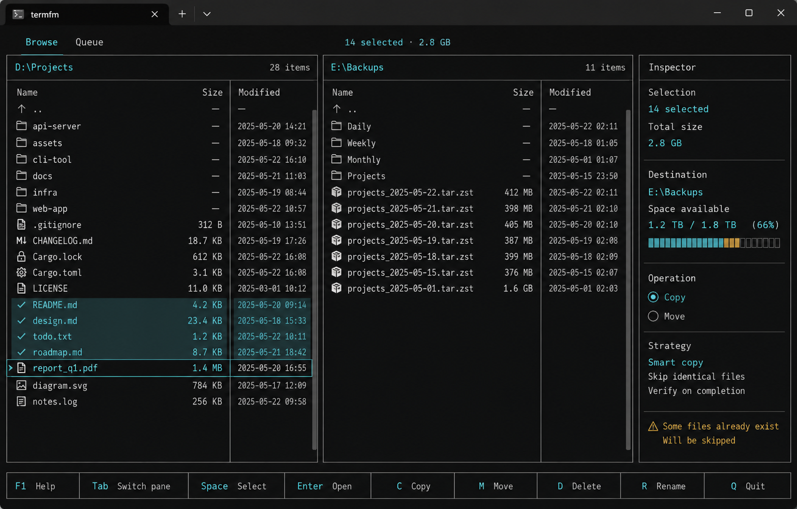
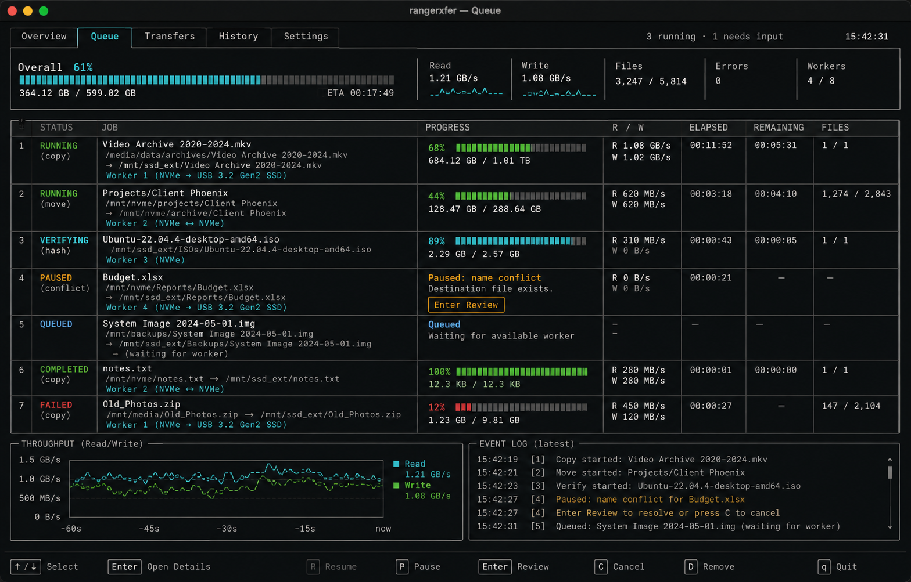
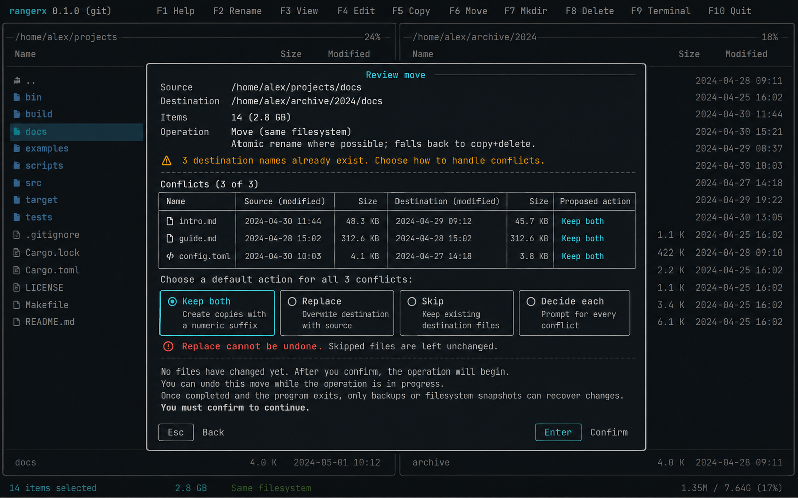

# FileAdmin interface concepts

The initial visual set explores one cohesive interface rather than unrelated
skins. Each image corresponds to a critical product state.

The renders are visual direction, not pixel- or text-exact specifications.
Terminal prototypes should use the accompanying wireframes and acceptance
criteria as the behavioral source of truth; incidental window chrome, dates,
paths, labels, and generated application names in the images are illustrative.

## Concept A: browse workspace

Purpose: make navigation, focus, selection, destination context, and available
actions legible at a glance.



```text
┌ Browse ───────────────── Queue: 2 active ─────────────── ? Help ┐
│ D:\Projects                       │ E:\Backups                  │
│ Name          Size      Modified  │ Name          Size          │
│ ▸ src/                  today     │   2026-09/                  │
│ ✓ target/     1.9 GB    today     │   archives/                 │
│ ✓ notes.md    14 KB     Sep 6     │   manifest.json  8 KB       │
│ > Cargo.toml  2 KB      Sep 7     ├─────────────────────────────┤
│                                  │ Selection                   │
│                                  │ 2 items · 1.9 GB            │
│                                  │ Space available 238 GB      │
├──────────────────────────────────┴─────────────────────────────┤
│ ↑↓ Move  ← Back  → Open/select  Enter Open  C Copy  M Move     │
└────────────────────────────────────────────────────────────────┘
```

The active pane uses a stronger border; the focused row uses a cursor and
background treatment; selection uses persistent checkmarks. These signals must
remain distinguishable without color.

## Concept B: activity queue

Purpose: explain concurrent work without pretending every job progresses in the
same way.



```text
┌ Queue ───────────── 3 running · 1 needs input ───── Overall 61% ┐
│ Copy video archive → External SSD                68%  412 MB/s  │
│ [███████████████████████──────────] 82/120 GB  ETA ~1m 32s     │
│ Move project → NVMe workspace                     finalizing    │
│ [██████████████████████████████████] atomic rename + metadata  │
│ Verify photos → NAS                              31%   91 MB/s  │
│ [██████████────────────────────────] 9,102 / 28,440 files      │
│ ! Report.csv conflict                             needs input   │
├ Throughput ────────────────┬ Recent events ─────────────────────┤
│ ▁▂▄▆▇▇▆▅▆▇  read / write   │ 14:32 Copy worker reduced to 2    │
│ Source busy; backpressure  │ 14:32 Destination latency stable  │
├────────────────────────────┴────────────────────────────────────┤
│ Enter Details  P Pause/Resume  R Retry  C Cancel                │
└─────────────────────────────────────────────────────────────────┘
```

Totals may initially be unknown while scanning. In that state the UI should say
`Discovering items…` and show an indeterminate activity indicator, never a fake
percentage.

## Concept C: action review and conflicts

Purpose: turn a risky confirmation into an understandable decision.



```text
│                 ┌ Review move ───────────────────────────────┐
│                 │ D:\Projects\release → E:\Backups\release │
│                 │ 14 items · 2.8 GB · 3 conflicts            │
│                 │                                             │
│                 │ report.csv   newer at destination  Keep both│
│                 │ app.exe      sizes differ          Keep both│
│                 │ notes.txt    identical             Skip     │
│                 │                                             │
│                 │ Conflict policy                              │
│                 │ > Keep both   Replace   Skip   Decide each   │
│                 │                                             │
│                 │ No files have changed yet. Cross-volume     │
│                 │ moves copy, verify, then remove each source. │
│                 │                                             │
│                 │ Esc Back                     Enter Confirm   │
│                 └─────────────────────────────────────────────┘
```

The review should describe the actual plan. For example, a same-filesystem move
may be an atomic rename, while a cross-filesystem move is a copy followed by
verified source removal. The confirmation language must change accordingly.

## Responsive layout

| Width | Browse layout | Queue layout |
| --- | --- | --- |
| `< 80` | Refuse full-screen mode with a clear minimum-size message | Same |
| `80–109` | Two panes; inspector becomes an overlay | One job list; details overlay |
| `110–149` | Two panes plus compact inspector | Jobs plus compact detail area |
| `150+` | Rich columns and inspector | Jobs, throughput, and event log |

Height degradation should remove preview detail before it removes paths,
selection, errors, or key hints.

## Shared visual language

- Neutral charcoal background with warm high-contrast text.
- Cyan marks focus and the active operation, but focus also has a cursor/border.
- Green means completed, amber means waiting or attention, and red means failed
  or destructive—not merely busy.
- One-cell dividers and restrained borders; nested boxes only where ownership is
  otherwise ambiguous.
- Monospaced alignment for comparable numbers; humanized sizes with exact bytes
  available in details.
- Spinners indicate activity without a measurable total. Bars indicate a known
  denominator. State words remain visible beside either.
- Footer hints are contextual and ordered from common to uncommon actions.

## Prototype acceptance criteria

- The three states above render at 80x24, 120x30, and 160x45 without overlap.
- Focus, selection, disabled actions, warnings, and failures remain legible in
  monochrome screenshots.
- Long paths, wide Unicode names, combining marks, and right-to-left filenames
  cannot corrupt adjacent regions.
- Resizing during a simulated transfer does not lose state or panic.
- A keyboard-only tester can browse, select, preview a copy, resolve a conflict,
  and inspect a failed job without external instructions.
